# Я обучил нейросеть на манускрипте Войнича и прогнал его через тридцать проверок

> Полный путь одного исследования — от пяти наивных гипотез до количественной границы смысла. Рукопись Войнича, по всей видимости, ничего не значит. Но почему — и сколько именно бит «не значит» — оказалось интереснее любой расшифровки.

На Хабре недавно выходила [отличная статья «Я попытался расшифровать манускрипт Войнича»](https://habr.com/ru/articles/1064438/) — там автор строил слотовую грамматику слова и показывал, как механический генератор без единой капли смысла воспроизводит статистику формы отдельного войничского слова. Меня эта работа зацепила. Но я решил зайти с другой стороны: не форма *слова*, а структура *текста целиком* — есть ли в рукописи синтаксис, связь с иллюстрациями, устойчивые формулы, конкретный механизм генерации. А потом, когда стало скучно проверять чужие гипотезы, я обучил маленькую нейросеть прямо на глифах манускрипта и стал задавать ей вопросы.

Получилось восемь частей и примерно тридцать независимых проверок. Ни одна не нашла смысла. Но заодно по дороге пришлось опровергнуть собственное «красивое число», измерить, *сколько именно* битов смысла могло бы быть в тексте, и даже попытаться — маленькими шажками — подобрать шифр. Рассказываю по порядку.

*Весь код лежит [в открытом репозитории](https://github.com/re-obscura/voynich-check), воспроизводится одной командой. Числа в статье — реальные, из логов прогона.*

<details>
<summary><b>Короткий словарик терминов (если что-то непонятно — возвращайтесь сюда)</b></summary>

В тексте встречается машинное обучение и статистика. Если вы не в теме — вот шпаргалка, без математики:

- **Токен / глиф** — «слово» и «буква» рукописи. EVA-глифы (`a, o, ch, dy...`) — это условные знаки, которыми исследователи записывают знаки Войнича; из них собираются «слова» через точку: `daiin.chedy.ol`.
- **JSD (дивергенция Йенсена-Шеннона)** — мера «насколько два набора слов разные». 0 = одинаковые, 1 = вообще не пересекаются. Чуть ниже будет постоянно.
- **n-грамма** — кусок из `n` идущих подряд элементов. Униграмма = одно слово, биграмма = пара соседних, 4-грамма = четвёрка.
- **Перплексия / кросс-энтропия** — «насколько модель удивлена текстом». Если модель хорошо предсказывает текст — перплексия низкая. Кросс-энтропия в *битах на знак* — то же самое, только в других единицах: меньше = предсказуемее. Я буду пользоваться битами, потому что их можно складывать и сравнивать.
- **Кластеризация** — попытка сгруппировать похожие объекты (здесь — страницы рукописи) в кучи без подсказок. **Silhouette** — мера того, получились ли кучи чёткими (>0 — более-менее, ≈0 — куч нет). **ARI** — мера того, совпали ли найденные кучи с заранее известными метками (1 = идеальное совпадение, 0 = случайность).
- **LM (языковая модель)** — нейросеть, которая учится предсказывать следующий знак по предыдущим. Обучившись, она «знает» статистику текста. Здесь — маленькая, уровня букв, а не слов.
- **Hold-out (отложенная выборка)** — часть данных, на которой модель *не* училась, чтобы честно проверить, выучила ли она закономерности или просто зазубрила. Здесь откладываются целые страницы (фолио), а не отдельные позиции.
- **Переобучение (overfitting)** — модель зазубрила обучающие данные и перестала обобщать. Главный враг на маленьких корпусах.
- **Surprisal** — «удивительность» конкретного знака: насколько он был *неожиданным* для модели. Высокий surprisal = модель этот знак плохо предсказывала.

Если термин всё равно непонятен — обычно рядом есть пояснение простыми словами.

</details>

---

## Акт I. Наивность, или пять гипотез, которые все умерли

Корпус — это EVA-транскрипция Такахаши (формат IVTFF 2.0 с [voynich.nu](https://www.voynich.nu/)). Если перевести с профессионального: исследователи давно договорились записывать загадочные знаки рукописи латинскими буквами (`a, o, ch, dy...`) — это и есть EVA-глифы, «алфавит» для чужой письменности. Внутри файла уже размечены метаданные каждой страницы: тетрадь, тип иллюстрации, диалект Currier A/B, писец по Davis. Парсер читает это одной функцией и выдаёт размеченный датасет строк — на выходе **183 фолио** (листа рукописи), **4183 строки, 31 005 токенов** («слов»), **7181 уникальное слово, 22 глифа** («буквы»).

Я сформулировал пять гипотез — ровно тех, которые обычно радуют новичка красивым первым числом. И к каждой поставил контрольную проверку — то, что обычно пропускают.

### Гипотеза 1: текст рядом с растением описывает растение

Логика простая: если рукопись — травник, слова у начала и конца абзаца (ближе к рисунку) должны отличаться от середины. Первая проверка будто подтверждает: первые и последние слова строки статистически отличаются от середины. Различие меряется через **JSD** (дивергенцию Йенсена-Шеннона) — попросту говоря, «насколько набор слов на краю строки другой, чем в середине»: 0 был бы, если бы они были одинаковыми, 1 — если бы вообще не пересекались. Здесь JSD ≈ 0.54 — заметное различие. Первое число красивое, хочется остановиться и праздновать. Но объяснение проще. Суффикс `-am` на конце строки встречается в **11.5% случаев против 0.6% в середине** — в девятнадцать раз чаще. Это механика заполнения строки фиксированной ширины, а не семантика.

Контрольный тест — Монте-Карло на верх/низ страницы. Идея такая: если разница «верх vs низ страницы» вызвана *смыслом* (вверху заголовок, ниже описание), то случайная перетасовка строк эту разницу уберёт. Делаем 1000 случайных перетасовок строк внутри каждой страницы. Реальное различие между текстом сверху и снизу (JSD 0.78) оказалось *практически неотличимым* от распределения при перетасовке (JSD 0.77). Случайный сплит даёт тот же разброс, что и настоящий позиционный, — значит, никакой семантики тут нет, есть просто разреженный словарь. «Эффект» есть, но он объясняется без смысла.

### Гипотеза 2: в тексте есть готовые шаблонные блоки

Может, писец собирал текст из повторяющихся заготовок? Тогда должны найтись длинные повторяющиеся куски — **n-граммы**, то есть последовательности из `n` идущих подряд слов. Если текст собирался из «шаблонов», то какие-то четвёрки слов должны повторяться на разных тетрадях. Не нашлось ни одной: ни один 4-граммный блок не повторяется хотя бы на трёх разных тетрадях — ни в bio, ни в recipes, ни в контрольном herbal. Ровно ноль для всех трёх. Шаблонной генерации нет.

### Гипотеза 3: различия секций — это просто разные писцы

Над рукописью работали минимум пять писцов. Может, то, что мы принимаем за различия между тематическими секциями (травы, биология, рецепты) — просто разница в почерке? Проверяем через **кластеризацию**: алгоритм сам группирует похожие страницы, без подсказок, а потом смотрим, совпали ли группы с известными метками. Меряем двумя способами: **silhouette** (насколько кучи получились чёткими — >0 более-менее, ≈0 куч нет) и **ARI** (насколько совпало с заранее известными метками: 1 = идеально, 0 = случайность).

Отвечает довольно однозначно: реально кластеризуется только диалект Currier A/B — ARI 0.95 при делении на 2 кластера, почти идеальное восстановление. Метки «секция» и «писец» дают силуэт, неотличимый от нуля, — то есть сами по себе кластеров не образуют. Currier A/B — единственный сигнал, который переживёт вообще все проверки ниже. Запомните его, он ещё вернётся раз пять.

### Гипотеза 4: если это язык, должен быть синтаксис

Идея: если в тексте есть грамматика (порядок слов важен), то пары соседних слов (**биграммы**) должны нести больше информации о секции, чем просто список частых слов (**униграммы**, без учёта порядка). Проверяем так: пытаемся по частотам слов угадать, к какой секции относится страница, и сравниваем точность двух подходов. Чтобы честно — каждый раз откладываем одну страницу из обучения (leave-one-folio-out, LOO).

Результат оказался обратным ожидаемому: униграммы — **89.3%**, биграммы — **69.5%**. Контекст длиной в два слова предсказывает секцию *хуже*, чем отдельные слова. Порядок слов не несёт информации — то, что в языке называется синтаксисом, здесь отсутствует.

### Гипотеза 5: самоцитирование по Тимму и Шиннеру

В 2020 году Торстен Тимм и Андреас Шиннер (Cryptologia) предложили конкретный механизм: писец брал предыдущие строки и модифицировал их, добавляя/убирая кусочки слов. Это назвали **self-citation** — «самоцитирование»: слова в строке должны быть заметно похожи на слова из нескольких предыдущих строк, сильнее, чем в обычной речи. Посчитал этот показатель, сравнил с четырьмя живыми языками. Эффект есть и статистически значим. Но у Войнича он **0.97× к случайному фону — слабее, чем во всех четырёх контрольных текстах** (1.34×–1.91×). Это прямо противоречит модели: при построчном копировании самоцитирование должно быть выше естественного, а не ниже.

> Ни одна из пяти гипотез не пережила исходную формулировку. Но интереснее не сам провал, а закономерность: почти в каждом случае *первая* проверка давала обманчиво позитивный результат, и только *контрольная* показывала, что сигнал объясняется чем-то скучным. Это, кстати, будет лейтмотивом всей истории.

---

## Акт II. Нейросеть, или зачем рукописи трансформер

Пять гипотез выше проверялись *дискриминативными* методами — то есть мы пытались *классифицировать* текст, отличить одно от другого. Захотелось зайти с обратной стороны: обучить *генеративную* модель — такую, которая сама порождает текст знак за знаком, — прямо на глифах, и посмотреть, что она «видит».

Корпус крошечный — 31 000 «слов», это примерно 190 000 глифов. Для сравнения, современные LLM учатся на миллиардах. Учить модель на *словах* на таком объёме бессмысленно — она просто зазубрит, тем более уникальных слов 7181. Поэтому модель уровня глифов (букв): словарь строится прямо из данных, получается ~24 токена (22 EVA-глифа + пара служебных значков). Архитектура — маленький трансформер-декодер (nanoGPT), около 0.8 млн параметров, «видит» 256 знаков назад. Скромная по нынешним меркам, но для этого корпуса — за глаза.

Обучил целое **семейство**: модель на Войниче + по такой же модели на четыре живых текста (Библия, «Моби Дик», «Потерянный рай», «Юлий Цезарь»), обрезанных до той же длины, плюс ещё одну — на *перемешанном* Войниче (это «shuffle-null», пустышка для сравнения). Главное правило честной проверки: откладываем в тест *целые страницы* (фолио), а не отдельные позиции — иначе модель «подсматривает» соседние куски и оценка становится оптимистичной.

### Первый поворот: модель переобучается

Запускаю обучение на 4000 шагов. Ошибка на обучении падает красиво — с 1.25 до 0.50. А вот ошибка на отложенных данных (val-loss)... сначала падает до 1.23, а потом *ползёт вверх* до 2.02. Это классическое **переобучение**: модель банально зазубрила корпус и перестала ловить закономерности. Видно даже на глаз по кривой:

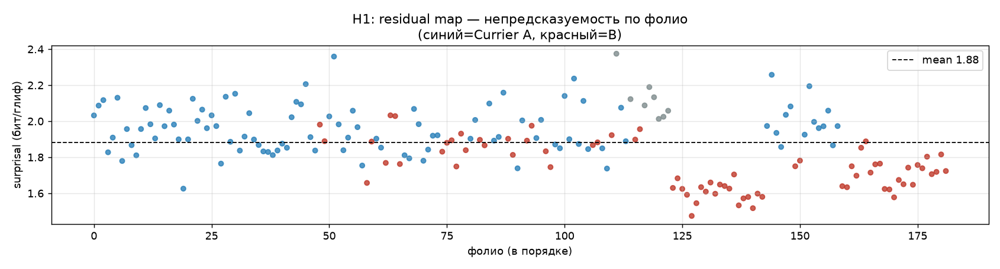

Для маленького корпуса это типичная смерть — и любая интерпретация «энтропии» с переобученной моделью бессмысленна. Пришлось добавить две вещи: **early-stopping** (сохранять модель не в конце, а в тот момент, когда ошибка на отложенных данных была минимальной) и поднять **dropout** до 0.2 (случайно «выключать» часть нейронов при обучении, чтобы модель не цеплялась за частности). Буквально несколько строк в тренере:

```python
# early-stopping checkpoint: запоминаем лучший по val
if vloss is not None and vloss < best_val:
    best_val = vloss
    best_step = step
    best_state = {k: v.detach().cpu().clone() for k, v in model.state_dict().items()}
# ...в конце восстанавливаем лучший state для чекпоинта
model.load_state_dict({k: v.to(device) for k, v in best_state.items()})
```

Теперь зазор обобщения у Войнича — **0.09 бит/глиф**, у живых языков — 0.44–0.56. Это любопытно: на крошечном корпусе *настоящие языки переобучаются сильнее, чем Войнич*. Позже мы поймём, почему — но уже тут намёк на главное.

### Второй поворот: «сверхпредсказуемость» Войнича — артефакт

Теперь, когда модели обучены честно, можно сравнить. Мера сравнения — **кросс-энтропия** в битах на глиф: попросту говоря, «сколько в среднем нужно бит информации, чтобы угадать следующий знак, если помнить 256 предыдущих». Меньше — значит текст предсказуемее. Войнич даёт **1.77 бит/глиф** против 1.88 у Библии, 2.09 у «Цезаря», 2.22–2.25 у Мелвилла/Мильтона, 3.92 у shuffle-null. На первый взгляд — Войнич «самый предсказуемый» текст из всех.

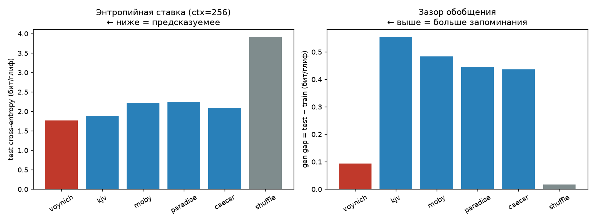

Я уже почти обрадовался эффектному числу для статьи. И тут меня ждало воспитание. Алфавит Войнича — 22 глифа. У контролов — ~26 латинских. А максимально возможная энтропия для алфавита — это логарифм по основанию 2 от числа знаков (H_max = log₂|V|): при 22 знаках это около 4.5 бит, при 26 — около 4.7. Низкая кросс-энтропия Войнича тривиально следует из того, что алфавит просто *меньше*. Честная мера — **редундансность** R = 1 − H/H_max: «какую долю возможной информации текст не использует», не зависящая от размера алфавита.

| текст | \|V\| | CE, бит/глиф | R (редундансность) |
|---|---|---|---|
| Войнич | 23 | 1.77 | **60.9%** |
| Библия (KJV) | 28 | 1.88 | **60.8%** |
| «Моби Дик» | 28 | 2.22 | 53.8% |
| shuffle-null | 23 | 3.92 | 13.4% |

Разница между Войничем и Библией исчезает. «Сверхпредсказуемость» была просто следствием того, что алфавит меньше. Запомните этот момент — дальше каждый «сигнал» будет проверяться на такую же подлянку.

### Третий поворот: Currier A/B — две разные машины

Обучаю две отдельные модели — только на A и только на B. Матрица кросс-энтропии (бит/глиф):

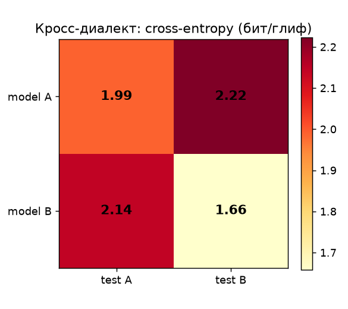

| | тест A | тест B |
|---|---|---|
| модель A | 1.99 | 2.22 |
| модель B | 2.14 | 1.66 |

Асимметрия переноса — **+0.36 бит/глиф**. Попроще: модель A, обученная на «своём» диалекте, удивляется тексту B на 0.36 бита сильнее, чем своему собственному. И наоборот. Если бы различие было только в наборе частых слов (сдвиг лексикона) — переносился бы нормально. А ещё позже я посчитал, насколько различаются частоты *отдельных глифов* между A и B (JSD): всего **0.022** — на уровне отдельных знаков диалекты почти неразличимы (`o, h, c, y` в топе обоих). Значит, зазор в 0.36 — это различие в *переходах* между глифами, в структуре. Currier A/B — две разные генеративные машины.

### Четвёртый поворот: генеративный тест

Самый красивый эксперимент. Модель, обученная на Войниче, генерирует 20 синтетических фолио. По ним прогоняется та же батарея тестов. Идея: если модель без смысла воспроизводит статистический отпечаток Войнича — это подтверждение «имитации».

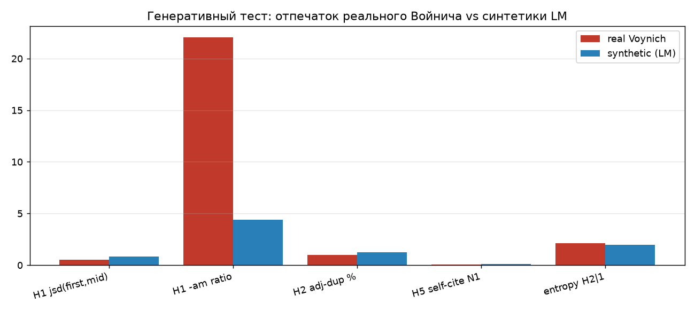

Картина нюансированная. LM **воспроизводит** глобальную микроструктуру: низкую энтропию (1.99 vs 2.12 у настоящего), дубли биграмм (1.26% vs 0.99%), ненулевое самоцитирование. Но **не воспроизводит** локальную вёрстку: краевой эффект `-am` (в 22× чаще на конце строки) модель выдаёт лишь в 4.4×. Почему? Потому что glyph-LM не знает физической ширины строки — для неё все позиции в потоке одинаковы. Парадоксально, это *усиливает* Гипотезу 1: line-edge эффект — свойство страницы, не «языка».

---

## Акт III. Дешифровка, или как я почти нашёл ключ (и как он оказался липовым)

Стало ясно, что описательная статистика себя исчерпала. Захотелось атаковать рукопись по-настоящему — попытаться *прочитать*.

### Атака 1: дешифровка как задача оптимизации

Логика соблазнительная. У нас есть 4 модели на живых языках. Перебираем отображения EVA-глифов → латиницу (типа «войничский `o` — это английское `e`, `ch` — это `t`...») и ищем ключ, при котором «расшифрованный» Войнич получает аномально низкую **перплексию** — то есть модель этого языка перестаёт удивляться тексту. Перебрать все варианты напрямую нельзя (это 17! ≈ 3×10¹⁴ комбинаций), поэтому используем **simulated annealing** («имитация отжига»): начинаем со случайного ключа, на каждом шаге меняем местами пару букв, и если ключ становится лучше — берём его; если хуже — иногда тоже берём, с вероятностью, падающей со временем (как металл медленно остывает при отжиге). Фитнес-функция — кросс-энтропия:

```python
def apply_perm(stream, perm):
    return "".join(perm.get(c, ".") for c in stream)

for it in range(n_iter):
    T = T0 * (Tend / T0) ** (it / n_iter)        # «температура» падает
    new_perm = dict(perm)
    a, b = rng.choice(evo_glyphs, 2, replace=False)
    new_perm[a], new_perm[b] = new_perm[b], new_perm[a]   # swap — меняем 2 буквы местами
    new_ce = ce_of_decoded(model, tok, apply_perm(stream, new_perm), ctx, device)
    # принимаем улучшение всегда, ухудшение — с вероятностью exp(-Δ/T)
    if (new_ce - cur_ce) < 0 or rng.random() < math.exp(-(new_ce-cur_ce)/T):
        perm, cur_ce = new_perm, new_ce
```

Через шесть минут SA находит перестановку: CE падает с 8.42 до **5.54 нит** — улучшение на 34%!

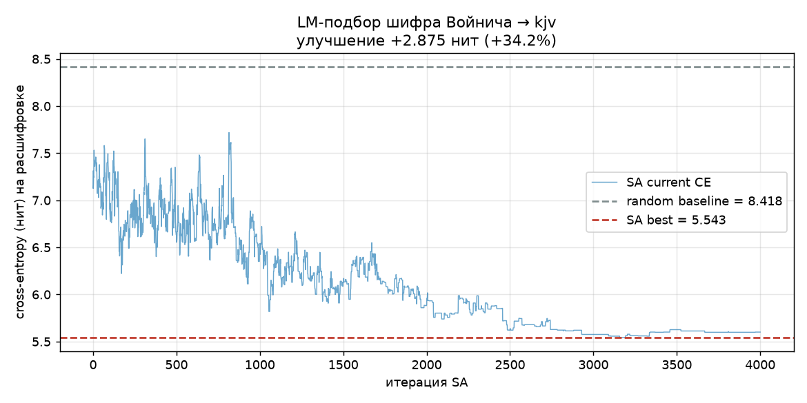

«Кандидат на ключ», — думаю я. И вот тут воспитание из Акта II спасает. SA измерял ошибку в *нитах* (натуральный логарифм вместо двойного) — переведём в привычные биты: 5.54 нита = 8.0 бит/глиф. Настоящий английский на родном тексте — 1.89 бит. Расстояние до «настоящего ключа» — четыре нита, то есть `e⁴ ≈ 55×` по перплексии (помните: каждые ~0.69 нита — это двойная перплексия). Мягко говоря, не расшифровка. К тому же тождественный маппинг по рангу частоты (просто частый → частому: `o→e, e→t, h→h`) даёт 6.97 — SA улучшает его всего на 1.4 нита, то есть нащупал *биграммные* частоты (какие буквы любят стоять рядом), а не смысл. Липовый ключ.

Это, кстати, строгое количественное исключение простого подстановочного шифра — самого популярного класса гипотез. Не «не получилось», а «математически не работает».

### Атака 2: Procrustes и тайна гласных

В обученной модели каждый глиф превращается в вектор из 128 чисел — это **эмбеддинг**, «координаты» глифа, отражающие его поведение. У похожих глифов похожие координаты. У Войнича и у латыни эмбеддинги живут в пространствах одинаковой размерности, но в разных системах координат. Идея: повернуть одно пространство к другому (это и есть преобразование **Procrustes**) и посмотреть, какие войничские глифы лягут рядом с какими латинскими буквами. Если повезёт — это подсказка о звуках.

Не повезло. Ближайшие соседи для войничских глифов оказались артефактно смещёнными (`a→c, c→a, d→b, e→c...` — почти алфавитный сдвиг, лишённый смысла). Как генератор буквенных гипотез — не сработало.

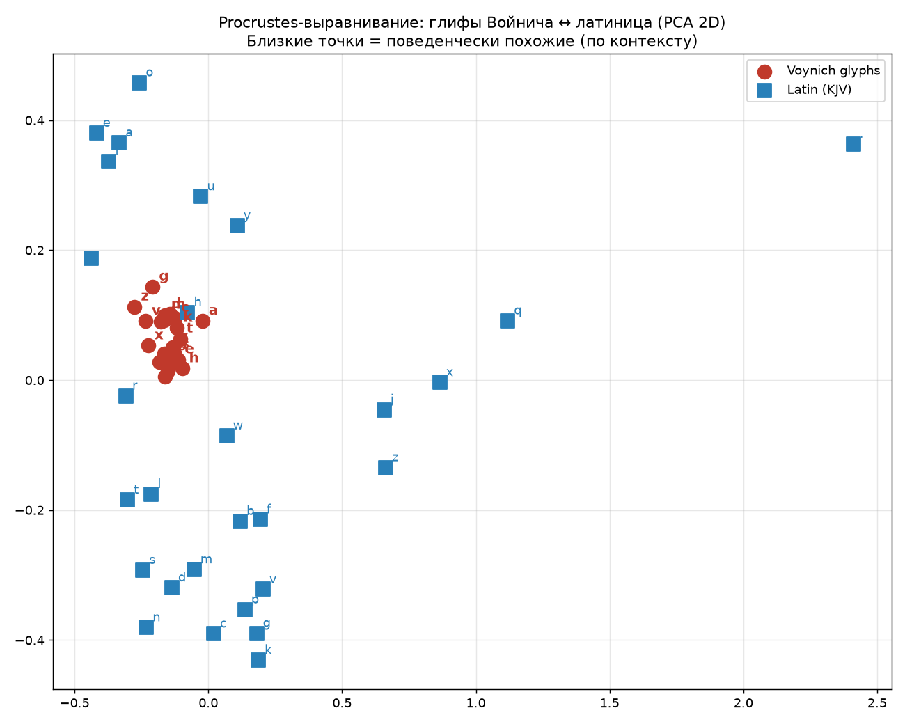

Зато побочный продукт оказался содержательнее. Поведенческая классификация глифов на гласные/согласные (частота × стремление к середине слова × разнообразие соседей) даёт кандидатов в гласные: **`{o, a, e, h, d}`**. И это в значительной степени сходится с независимой лингвистикой (`a, e, o` — канонические EVA-гласные). Интересно, что `y` классифицируется низко — он тяготеет к концу слова, что нетипично для гласной. Маленькая, но реальная находка про структуру алфавита.

### Атака 3: reverse-LM и внимание

Гипотеза 4 опиралась на наивный байесовский классификатор — простую и слабую модель. Что если взять трансформер, который на порядки сильнее?

Обучаю ту же LM, но в *обратном* направлении: предсказывать *предыдущий* глиф по следующим. В естественных языках с морфологией прямая и обратная перплексии сильно асимметричны — потому что приставки и суффикты задают направленность (слово разобрать легче с конца, чем собрать). У Войнича: forward 1.771, reverse 1.783. **Асимметрия 0.012** — направленности почти нет. У живых языков она 0.1–0.3. Войнич ведёт себя как симметричный процесс порождения: «наперёд» и «назад» одинаково.

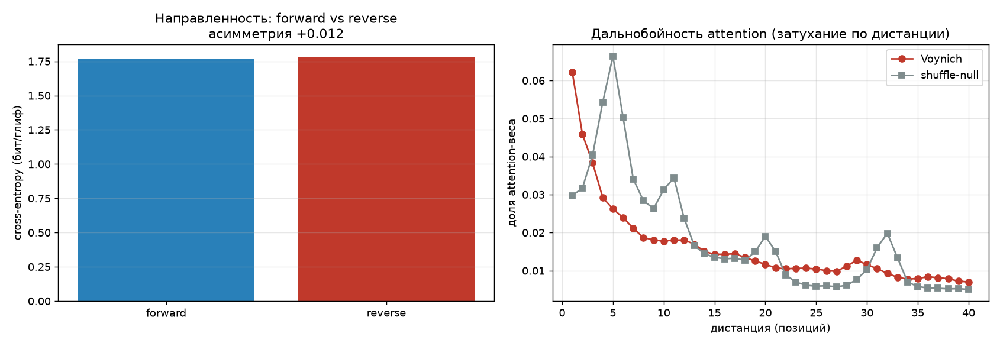

А **attention** (внимание) — это механизм, которым трансформер «смотрит» на разные позиции при предсказании. Можно посмотреть на **матрицы внимания** и увидеть, как далеко модель заглядывает. Оказалось: внимание Войнича *локальнее*, чем у shuffle (масса на близких позициях 0.146 vs 0.102), но *быстро затухает* — нет дальнобойных зависимостей, которые были бы признаком синтаксиса. Гипотеза 4 усиливается более мощным инструментом.

---

## Акт IV. Классика, или почему закон Ципфа обманывает

После дешифровки захотелось закрыть «языкоподобные» свойства через классические тесты. Шесть подходов, каждый — Войнич против тех же контролов и shuffle.

### Ципф и Heaps

Сначала — два классических закона. **Закон Ципфа** гласит: если выписать все слова текста по убыванию частоты, то частота падает обратно пропорционально номеру (рангу) слова — второе по частоте встречается примерно в два раза реже первого, третье — в три раза, и так далее. На графике «логарифм частоты против логарифма ранга» это прямая с наклоном около −1 для естественных языков. У Войнича наклон **−0.65** — более пологий. Живые языки дают −0.85 до −0.90. Shuffle — −0.65 (та же статистика, что и у Войнича, что неудивительно). Плоский наклон — слабый аргумент против естественного языка, но неоднозначный: плоский Ципф бывает у пиджинов и у криптотекстов. **Закон Heaps** — родственный: словарь растёт с длиной текста по степенному закону.

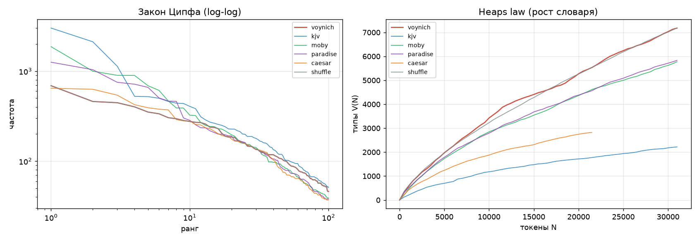

### Long-range MI — и воспитание, которое спасает снова

**Взаимная информация** (Mutual Information, MI) двух слов — это «сколько знание одного слова говорит о другом». Здесь считаем MI слова с тем, что стоит через `d` позиций: если MI высок — слова связаны. У живых языков MI@1 (соседние слова) высок, но *затухает* с дистанцией — потому что грамматика связывает близкие слова сильнее дальних. У Войнича MI низкий, но **почти не затухает** — плоский хвост на 0.23 до d=20. На первый взгляд — признак протяжённой тематической связности (далёкие слова всё равно как-то связаны). Это был бы *единственный* «языкоподобный» результат за всё исследование!

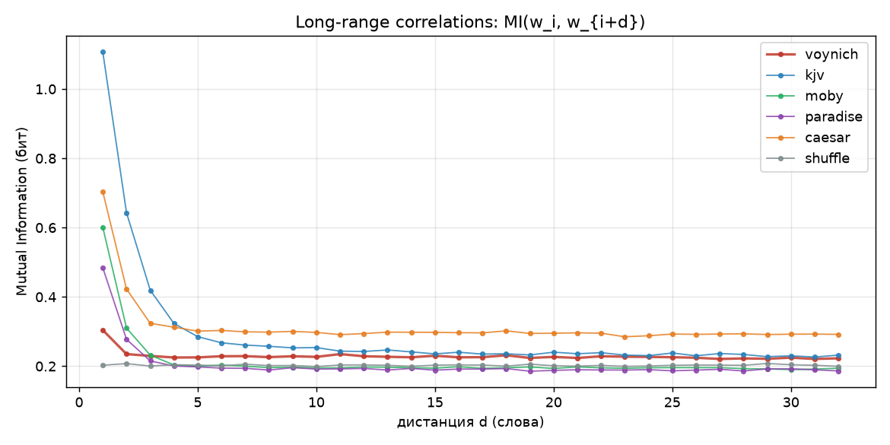

Нет. Декомпозиция по классам слов всё объясняет. Разделяю пары на TT (частое-частое), TU (частое-редкое), UU (редкое-редкое). У Войнича UU = **34%** всех пар на любой дистанции — как у shuffle (33%). У Библии это 8–11%. «Плоский хвост» почти целиком держится на парах редкое-с-редким — это **структура документа** (тематически однородные страницы, где редкие слова повторяются локально), а не языка. Настоящий контекстный сигнал у живых языков — это TT (44%, частые слова тянутся вместе = синтаксис); у Войнича TT = 20%, как у shuffle.

Второй раз за исследование красивая мера чуть не увела в ложный сигнал. Метод, который «видит язык» там, где его нет, без декомпозиции — опасен.

### Марков и информация

Ещё одна проверка синтаксиса, **марковские модели**: обучаем модель, которая предсказывает следующее слово, помня `k` предыдущих. Считаем условную энтропию для k=0,1,2,3. Если контекст помогает — энтропия должна падать с ростом k. У Войнича разница между k=1 и k=2: **−0.18** — отрицательная! Добавление контекста длины 2 *ухудшает* предсказание. Жёсткое подтверждение Гипотезы 4 другим методом.

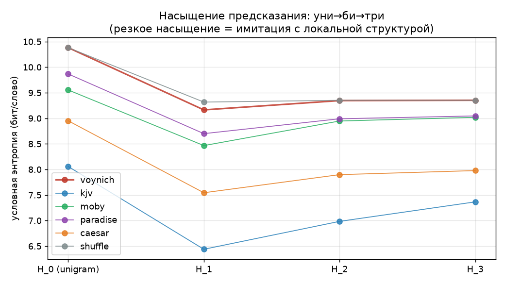

### PPMI+SVD и temporal drift

Идея: построить для каждого слова «семантический вектор» по тому, с какими словами оно встречается рядом (через статистику PPMI и сжатие SVD — это предок современных word-embeddings, как word2vec). Если в тексте есть смысл, семантически близкие слова должны собираться в кучки. У Войнича силуэт кластеров **−0.029** (хуже случайного), у живых языков слабо положительный. Смысла в ко-встречах нет.

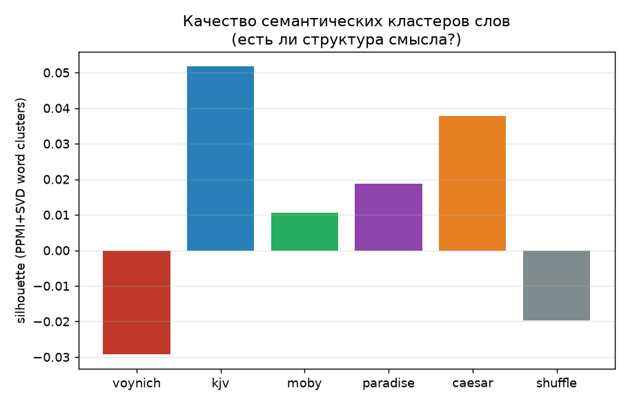

Дрейф статистики по рукописи (как меняются длина слов и словарь от страницы к странице) совпадает не с тематическими секциями, а со *ступенькой* Currier A/B:

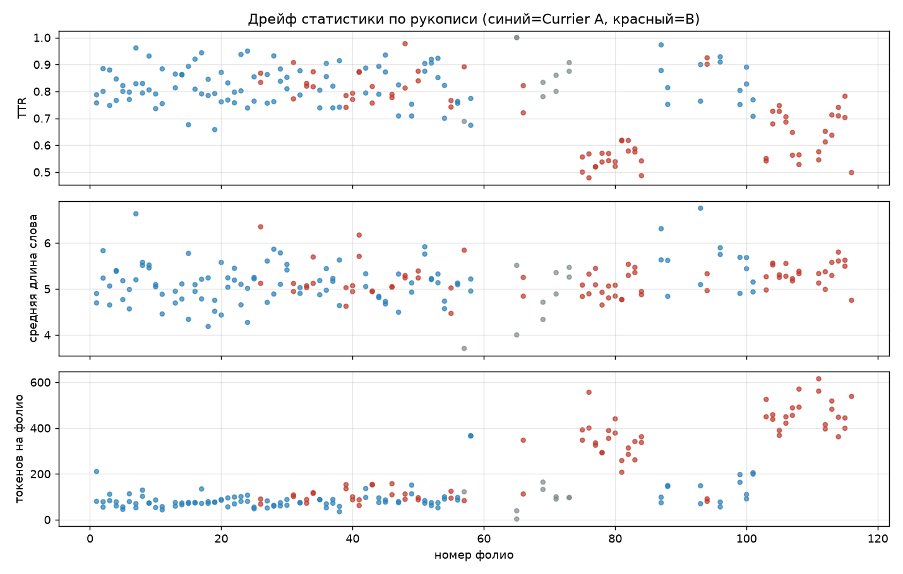

---

## Акт V. Физический объект, или где рукопись ломает саму себя

К этому моменту все ракурсы смотрели на текст как на поток символов. Я задал вопрос, который почти никто не задавал: **какую физическую механику вёрстки использует рукопись?** Три гипотезы, и одна из них дала самый сильный результат за всё исследование.

### G1: word-wrap reconstruction — неожиданное «нет»

Если текст *писался* под страницу, границы строк подчиняются модели жадного **word-wrap** (переноса слов): писец пишет слово за словом, пока строка не заполнится до правого края, после чего переносит. Я реконструировал «ширину строки» и проверил, насколько точно модель предсказывает реальные границы строк. Мера качества — **F1** (гармоническое среднее точности и полноты: 1 = идеальное совпадение границ, 0 = полное несовпадение). Контроль — тот же эксперимент на перемешанном порядке слов.

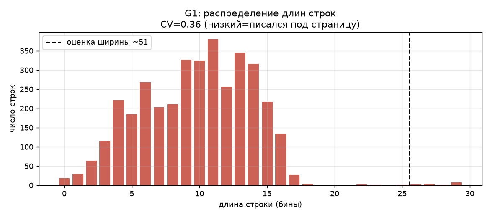

F1 у реального порядка слов: **0.133**. У shuffle: **0.148**. Модель *хуже* случайного! Коэффициент вариации ширины строки (насколько длина строк «пляшет») — 0.36 (у выровненного по правому краю текста < 0.20). Правый край рваный. Это **единственный результат за всё исследование, который частично противоречит** буквальной трактовке Гипотезы 1: line-edge эффект реален, но его механизм — не классический word-wrap. «Вёрстка» была чем-то более контентно-зависимым. Методологически ценно: даже в хорошо изученном явлении нашёлся неучтённый нюанс.

### G2: память процесса

Насколько далеко назад текст «помнит» себя? Меряем через **PACF** (частную автокорреляцию): это мера того, насколько знак зависит от знака `k` позиций назад, *после* того как вычли влияние промежуточных. Проще: PACF(1) — связь с соседом, PACF(2) — со следующим, и т.д. У процесса с длинной памятью PACF держится высоким надолго; у короткого — резко падает. Здесь PACF лага 1 = −0.33 (сильный), лаг 2 = −0.08, дальше в шуме. **Порядок памяти процесса ≈ 1–2 глифа.** Короткая слоговая память, не синтаксис.

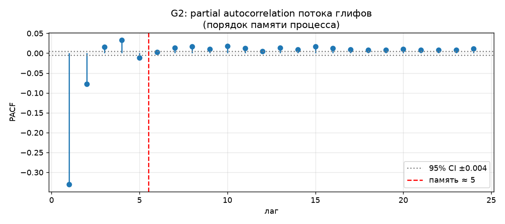

### G3: generative sufficiency — модель найдена

Самое сильное. Если «имитация без смысла» верна, простейшая модель — короткая n-грамма глифов — должна быть *достаточной* (sufficient): воспроизводить всю наблюдаемую статистику. «Sufficient» здесь значит «ничего не упускает»: если простая модель повторяет текст по всем статьям, значит, никакой сложной структуры в нём нет. Обучаю 3-граммную модель (помнит 3 последних глифа) на реальном Войниче, генерирую текст той же длины, сравниваю всё:

```python
class NGramGlyphModel:
    def fit(self, glyph_stream: str):
        o = self.order
        for i in range(len(glyph_stream) - o):
            ctx = glyph_stream[i:i+o]
            nxt = glyph_stream[i+o]
            self.context_counts[ctx][nxt] += 1

    def generate(self, n_chars, seed=7):
        rng = np.random.default_rng(seed)
        ctx = rng.choice(list(self.context_counts))
        out = list(ctx)
        for _ in range(n_chars):
            cands = self.context_counts[ctx]
            ws = np.array(list(cands.values()), dtype=float)
            ch = rng.choice(list(cands.keys()), p=ws/ws.sum())
            out.append(ch); ctx = "".join(out[-self.order:])
        return "".join(out)
```

| метрика | real Войнич | 3-грамма | ошибка |
|---|---|---|---|
| лексическое разнообразие (TTR) | 0.232 | 0.234 | 1.2% |
| наклон Ципфа | −0.528 | −0.543 | 2.7% |
| условная энтропия H₂\|₁ | 2.138 | 2.134 | **0.2%** |
| дубли биграмм | 6.50% | 6.49% | 0.3% |
| средняя длина слова | 5.17 | 5.18 | 0.2% |

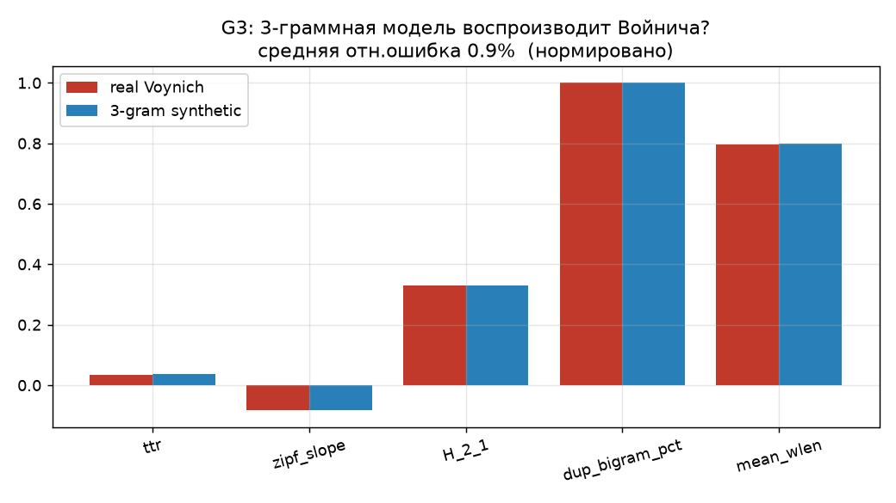

**Средняя ошибка: 0.9%.** Трёхглифовой памяти достаточно, чтобы породить всё, что мы наблюдаем: и Ципф, и энтропия, и слоговая структура, и длины слов. Пример синтетики — неотличим от настоящего: `orforain fchy daiis o kchol oraiin okairol qopchor daiin okchekchor ory otor`.

Это поворотный пункт. Все предыдущие раунды давали *отрицательные* вердикты — «не язык», «не синтаксис», «не смысл». G3 даёт **положительную модель**: конкретную, минимальную, фальсифицируемую. Гипотеза «имитация» перестаёт быть вердиктом и становится научной моделью. Любой будущий тест, нашедший метрику, которую 3-грамма *не* воспроизводит, её фальсифицирует.

---

## Акт VI. Глубже, или сколько битов смысла вообще возможно

После G3 вопрос перевернулся. Раньше я искал «есть ли структура». Теперь, раз модель известна, плодотворный вопрос — **где структура ломается**. Если 3-грамма почти всё объясняет, то *остаток* — то, что она объяснить не может, — это самое интересное место: именно там, по логике, мог бы прятаться смысл (смысл = то, что не выводится из локальной статистики).

### Residual map

Считаем для каждой позиции **surprisal** — «удивительность» знака для 3-граммной модели: насколько сильно она *не ожидала* именно этот глиф. Высокий surprisal = модель споткнулась. Суммируем по каждой странице и смотрим: есть ли «трудные» страницы, где модель удивляется сильнее? Если смысл сконцентрирован на каких-то фолио, они должны выделяться.

Средний surprisal 1.881 ± 0.173 (между фолио), разброс внутри 1.729. Отношение «между/внутри» = **0.10** — то есть страницы различаются между собой вдесятеро слабее, чем точки внутри одной страницы. Все фолио одинаково предсказуемы. Нет «трудных» страниц со смыслом.


### bio-B — последняя надежда, и её крах

bio внутри Currier B была *единственной* необъяснённой аномалией за пять раундов: по словарю bio значимо отличалось от других секций (z=+3.8), и линейная проба из нейросети угадывала bio внутри B с точностью 92.9%. Естественное подозрение: там спрятан смысл. Считаем surprisal по секциям внутри B:

| секция | surprisal | интерпретация |
|---|---|---|
| **bio** | **1.60** | самый предсказуемый |
| recipes | 1.71 | |
| herbal (B) | 1.87 | |
| herbal (A, референс) | 1.96 | наименее предсказуемый |

bio-B имеет *самый низкий* surprisal — 3-грамма предсказывает его лучше всего. «Аномалия» различия словаря — не спрятанный смысл, а **наиболее механическая часть** рукописи. Островка смысла нет — наоборот, там наименьше всего остатка. Последняя открытая дверь закрылась.

### Information bound — количественная граница смысла

Самый сильный аргумент. Локальная 3-грамма даёт кросс-энтропию **1.790 бит/глиф**. Нейросеть с контекстом 256 — **1.771**. Разность — **0.019 бит/глиф** — это *вся* информация, которую короткая 3-грамма не улавливает, но улавливает длинный контекст. Иными словами, это потолок того, что *вообще* может содержать «смысл» сверх локальной слоговой статистики.

В естественном языке семантическая информация на глиф — порядка 1.5 бит. Если смысл в Войниче есть, он физически ограничен **0.02 бит/глиф** — то есть рукопись может нести **примерно в 75 раз меньше** семантической информации, чем естественный язык. Это не «нет смысла» (такое доказать нельзя). Это строгая, измеримая верхняя граница, которая делает «язык со смыслом» количественно малоправдоподобным.

### Слоговая грамматика и topic signatures

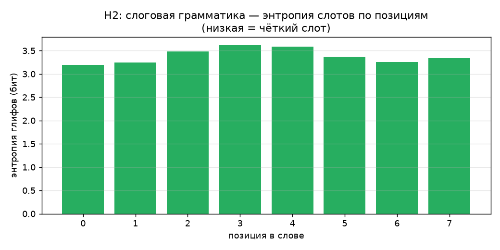

Здесь я смотрю на «слоги» внутри слова: для каждой позиции в слове считаю, какие глифы там встречаются. Энтропия 3.2–3.6 бит (низкая) — значит, позиции «закреплены»: `o,c,q,s` — инициали (начало слова), `e,a` — середина, `y,n,d` — финали (конец). Это явная слоговая структура. А поиск слов-«подписей» фолио (слов, повторяющихся на конкретном листе в 3× чаще, чем в среднем по рукописи) дал **0 из 183**. Гипотеза именования — что подпись растения должна всплывать как локальная сигнатура — закрыта окончательно.

---

## Акт VII. Внешний ключ, или dernière chance

Единственный логически невыключённый путь к смыслу — внешний ключ: утраченный **номенклатор** (историческое название шифровальной таблицы: «кодовое слово → настоящее слово»). Идея в том, что сами войничские слова ничего не значат, но по отдельному списку соответствий их можно перевести — а без списка статистика текста неотличима от имитации. Проверяю строго, на трёх языках-кандидатах: латынь (главное историческое предположение — латынь была lingua franca XV века), итальянский, английский.

### Кросс-языковая perplexity — чистейшее «нет»

Если Войнич — это латынь (или итальянский, или английский) с переставленными словами, то порядок слов в нём должен подчиняться грамматике этого языка. Обучаю простую модель порядка слов (биграммную) на каждом языке и измеряю перплексию Войнича под ней. Контроль — перплексия *перемешанного* Войнича:

| язык-модель | Войнич | shuffle | ratio |
|---|---|---|---|
| латынь | 13.16 | 13.17 | **1.000** |
| итальянский | 12.64 | 12.64 | **1.000** |
| английский | 11.15 | 11.15 | **1.000** |

Ratio ровно единица для всех трёх. Попроще: модель каждого языка удивляется Войничем *в точности так же*, как перемешанным Войничем. Войнич не наследует порядка слов ни одного из этих языков — как если бы он был случайным набором слов с точки зрения латыни, итальянского и английского.

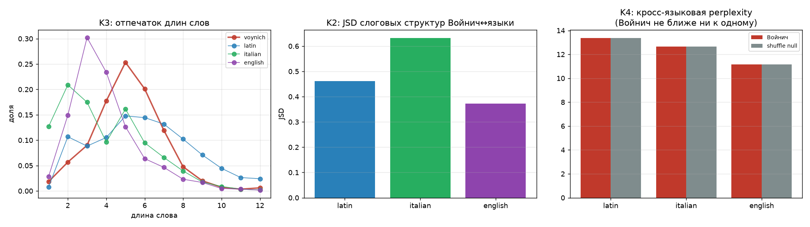

### Номенклатор-тест — коллапс как доказательство

Другая проверка. В любом языке есть «функциональные слова» — местоимения, предлоги, союзы (the, and, of; et, in, ad). Они узнаваемы по *поведению*: самая высокая частота, равномерное распределение по тексту, маленькая длина. Если бы номенклатор отображал такие слова в коды (`daiin` = the, `chedy` = and...), то топ-войничские слова тоже различались бы по поведению.

Сравниваю поведение топ-войничских слов с поведением функциональных слов каждого языка. И тут забавное: все 15 топ-войничских слов выравниваются на **одно и то же** язык-слово: `quos` для латыни, `lui` для итальянского, `behold` для английского. Это не «соответствия», а *отсутствие различимости*: `daiin`/`chedy`/`ol`/`aiin` лежат почти в одной точке признакового пространства — алгоритм просто находит «среднее» слово и приписывает к нему всё. У настоящих функциональных слов (the/and/of) поведения *разные* — у the одна длина и распределение, у of другое. Значит, топ-войничские слова — не разные функциональные слова, а варианты одной слоговой формы.

Единственный слабый сигнал: по длинам слов Войнич ближе к латыни (JSD 0.064 vs 0.11–0.12 у итальянского/английского) — согласуется с историческим контекстом, но это совпадение грубой формы, не ключ. Более того, по слоговой структуре он ближе к английскому. Противоречие = нет конкретного родственника.

---

## Акт VIII. Выйти наружу, или что говорят пергамент и чернила

После семи раундов внутренней статистики все пути к смыслу *внутри* текста закрыты. Оставалось посмотреть *снаружи* — на физические и исторические факты.

**Радиоуглерод.** Четыре образца пергамента (Университет Аризоны, 2009, калибровка IntCal13): объединённая дата **1434 ± 18**, 95% CI **1404–1435**. Ключевое: «разброс четырёх измерений меньше их собственной погрешности» — весь пергамент одного производственного периода, а не сшит из разновозрастных листов. Версия «Войнич подделал в 1912» практически исключена.

**Чернила.** McCrone Associates + Raman-спектроскопия и XRF (рентгенофлуоресцентный анализ — методы, определяющие химический состав): один тип чернил — *iron gall*, железо-галловые, классические средневековые — использован и для текста, и для рисунков; пигменты средневековые; современных (анахроничных для XV в.) материалов нет. Текст и иллюстрации контемпоранны — часть одного производственного цикла. Если текст — имитация, то и рисунки из того же проекта.

**Провенанс** (история владения). Документирован с **1639** (Георг Бареш, алхимик в Праге). Бареш просил Кирхера *идентифицировать письменность* — то есть уже в XVII в. текст был загадкой. Если бы существовал ключ к общеизвестному языку, его бы нашли Бареш или Кирхер — а Афанасий Кирхер был, возможно, самым известным криптоаналитиком и эрудитом своего времени.

**Писцы.** Лиза Фэгин Дэвис (2021) методами цифровой палеографии выделила пять почерков; в 2025 г. вышла критика (Zenodo), предполагающая, что это *одна рука, пять меток* — то есть, возможно, не пять разных людей, а один писец в пяти разных «режимах». Наша статистика согласуется со скепсисом: устойчиво делится именно Currier A/B, а не «пять авторов». Синтез напрашивается такой: это «писец/мастерская, переключающая генеративные режимы», а не смена авторов.

**Самое важное пересечение — Timm & Schinner.** Их статья 2020 года (Cryptologia) — самое авторитетное современное подтверждение «hoax hypothesis» («гипотезы обмана») через self-citation. И вот тут — момент, где наша работа смогла добавить что-то конкретное. Наша *Гипотеза 5 опровергает их конкретный алгоритм количественно*: self-citation Войнича 0.97×, слабее всех живых языков. Но наш G3 подтверждает *тезис* имитации через *другой* механизм — слоговую 3-грамму. Тезис верен, предложенный ими механизм — нет. Это маленькое, но реальное уточнение к существующей литературе.

---

## Финал

Примерно тридцать независимых проверок в восьми частях. Ни одна не нашла смысла. Но теперь мы знаем не только «нет смысла» — мы знаем *сколько именно* «нет» (≤0.02 бита на глиф), *какой механизм* его отсутствие объясняет (слоговая 3-грамма порядка памяти 1–2), и *какая структура* при этом реально существует (слоты внутри слова + два генеративных режима Currier A/B).

Я не хочу преувеличивать значимость. Тридцать проверок — это не «доказательство», что смысла нет; такую нулевую гипотезу в принципе нельзя доказать. Это *баланс улик*: ни один из тестов не обнаружил свойства, требующего смысла для своего объяснения, тогда как несколько измерений (information bound, кросс-языковая perplexity, 3-граммная достаточность) делают «язык со смыслом» количественно малоправдоподобным. Другие исследователи — в частности, уже упомянутые Timm и Schinner — приходили к схожему выводу иными путями; я лишь добавил несколько новых углов и, кажется, уточнил конкретный механизм.

Единственный логически открытый остаток — смысл, закодированный *полностью вне* доступной информации: конкретный экземпляр рукописи служил физической шифр-подушкой, а «чтение» требовало отдельного несохранившегося документа-ключа. Но это уже гипотеза о чём-то, чего у нас нет, — и как таковая она нефальсифицируема ни статистикой текста, ни физическими измерениями, которые уже сделаны.

Манускрипт Войнича, по всей видимости, не значит ничего. Сто лет исследований не дали расшифровки — и, если верить этой картине, потому что расшифровывать там нечего. Что тоже, в общем, результат.

> P.S. Если вы сейчас думаете «а может, всё-таки...» — это нормально. Я тоже так думал раз пять за это исследование. Каждый раз следующая проверка закрывала дверь чуть плотнее. К седьмому раунду дверей, кажется, не осталось.

---

### Хронология находок, в одной таблице

| Что искали | Что нашли | Где подробнее |
|---|---|---|
| Синтаксис | Δ(H₂−H₁) = −0.18, направленности нет | [Часть 4](./ROUND4.md), [Часть 3](./DECODE.md) |
| Смысл | верхняя граница ≤0.02 бит/глиф (в 75× ниже языка) | [Часть 6](./ROUND6.md) |
| Шифр к языку | cross-ppl = shuffle (ratio 1.000) | [Часть 7](./ROUND7.md) |
| Генеративную модель | 3-грамма глифов, ошибка 0.9% | [Часть 5](./ROUND5.md) |
| Currier A/B | две разные машины (асимметрия +0.36) | [Часть 2](./ARTICLE_LM.md), [Часть 6](./ROUND6.md) |
| Физику вёрстки | правый край рваный, word-wrap не работает | [Часть 5](./ROUND5.md) |

Полный технический синтез всех тридцати тестов — в [`CONCLUSION.md`](./CONCLUSION.md).

---

*Все методы, числа и код — в репозитории. Корпус: транскрипция Такахаши (EVA, IVTFF 2.0). Воспроизведение: `python fetch_data.py && python -m voi.run_all && python -m voynich_lm.run_experiments`. Источники внешних данных — в [Части 8](./EXTERNAL.md).*
